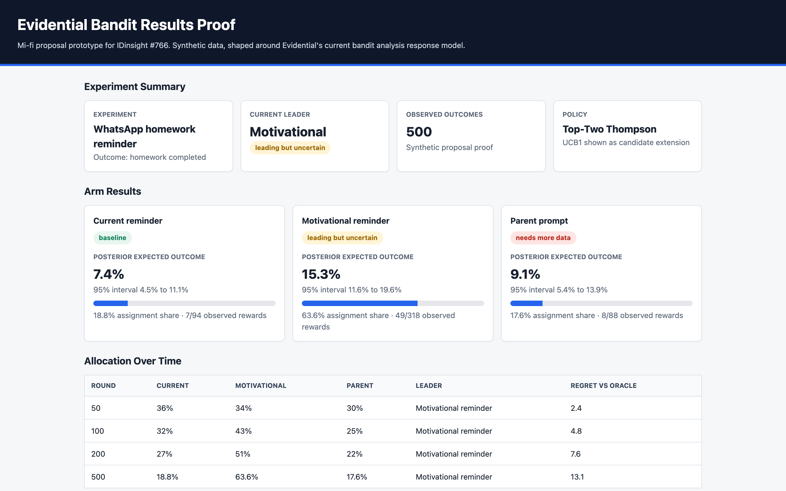
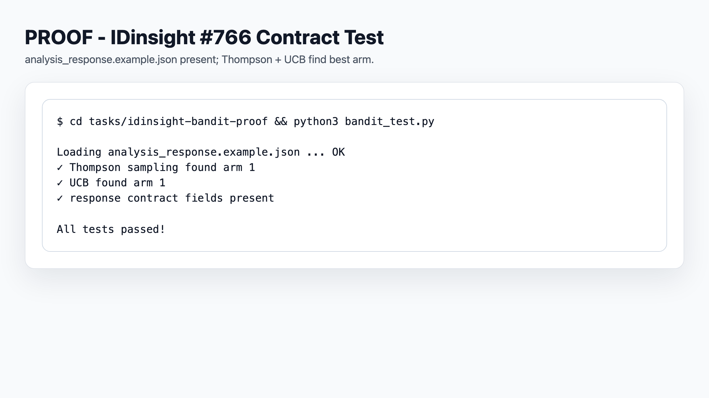
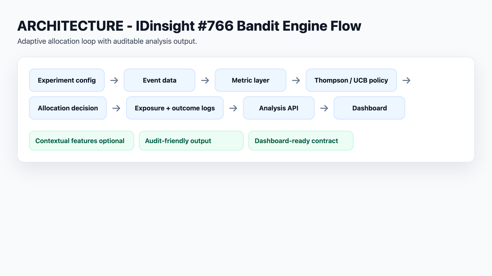

# IDinsight #766 Bandit Results Proof

This is a pre-submission proof package for the C4GT DMP 2026 proposal.
It is not upstream Evidential code. It shows how the existing Evidential
bandit analysis surface can be translated into a dashboard and replay view.

## What It Proves

- The proposal is grounded in existing Evidential backend models.
- Bandit outputs can be shown to nonprofit users without exposing raw internals first.
- A small policy boundary can support Thompson Sampling, UCB, CMAB, and replay/audit metadata.
- The dashboard work can stay close to `BanditExperimentAnalysisResponse` instead of inventing a separate analytics model.

## Scenario

The demo uses a nonprofit education program testing WhatsApp reminder flows:

- Current reminder
- Motivational reminder
- Parent prompt

The synthetic outcome is homework completion. The numbers are intentionally small and conservative, because many nonprofit experiments will have sparse or delayed reward data.

## Files

- `selection-patterns.md`: why this proof is shaped like selected C4GT/GSoC proposals.
- `analysis_response.example.json`: an Evidential-shaped bandit analysis payload.
- `synthetic_bandit_summary.csv`: synthetic allocation and reward summary.
- `index.html`: static mi-fi dashboard prototype.
- `dashboard-mapping.md`: backend-to-dashboard field mapping.
- `policy-contract.md`: proposed policy boundary mapped to existing backend functions.

## What This Is Not

- Not a merged upstream feature.
- Not a replacement for Evidential's existing Thompson/CMAB implementation.
- Not a claim that the synthetic data proves real-world impact.

This is proposal evidence: it shows the implementation direction, the product surface, and the level of codebase understanding behind the proposal.

<!-- C4GT_VISUAL_SCREENSHOTS_START -->
## Visual Proof Screenshots

Generated reviewer-facing PNGs. Runtime/prototype screenshots lead each project; architecture and proof tables remain supporting evidence. Prototype images do not expand the verified implementation boundary.

### Prototype dashboard: arms, allocation, uncertainty, and policy recommendation.

Path: `screenshots/prototype-bandit-dashboard.png`

### Terminal proof: analysis_response.example.json contract test passes.

Path: `screenshots/analysis-contract-test-pass.png`

### Bandit engine flow: config -> events -> policy -> API -> dashboard.

Path: `screenshots/bandit-engine-flow.png`
<!-- C4GT_VISUAL_SCREENSHOTS_END -->
